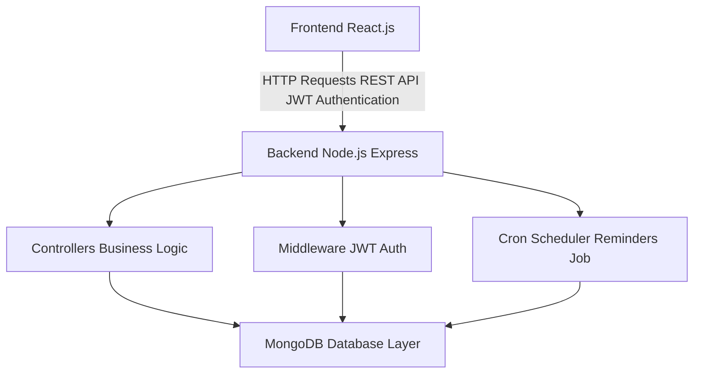

# Habit Tracker App

A full-stack Habit Tracker web application that enables users to create, manage, and track daily habits with authentication, reminders, and progress tracking.

## Features

- User authentication and authorization using JWT
- Create, update, and delete daily habits
- Track habit completion status
- Automated reminders using scheduled cron jobs
- RESTful APIs for all core operations
- Secure backend with token-based authentication
- Responsive frontend for user-friendly experience

## Tech Stack

Frontend:
- React.js

Backend:
- Node.js
- Express.js

Database:
- MongoDB

Authentication:
- JSON Web Tokens (JWT)

Deployment:
- Microsoft Azure

## Project Structure

```bash
habit-tracker-app/
│
├── client/                 # React frontend
│   ├── src/
│   └── public/
│
├── server/                 # Express backend
│   ├── controllers/
│   ├── models/
│   ├── routes/
│   ├── middleware/
│   ├── config/
│   └── server.js
│
├── .env
├── package.json
└── README.md
```

## Architecture



## Flow

- User registers or logs in through the frontend  
- Backend validates credentials and generates a JWT token  
- Token is used for accessing protected routes  
- User creates and manages habits  
- Data is stored and retrieved from MongoDB  
- Cron jobs run periodically to trigger reminders for pending habits  

## Authentication Flow

- User registration and login with secure password hashing  
- JWT token issued upon successful authentication  
- Token sent in request headers for protected APIs  
- Middleware verifies token before allowing access  

## Reminder System

- Cron jobs execute at scheduled intervals  
- System checks incomplete habits for users  
- Reminder logic triggers based on scheduled tasks  
- Helps users maintain consistency in habit tracking  

## API Endpoints

### Authentication

- POST /api/auth/register → Register user  
- POST /api/auth/login → Login user  

### Habits

- GET /api/habits → Fetch all habits  
- POST /api/habits → Create habit  
- PUT /api/habits/:id → Update habit  
- DELETE /api/habits/:id → Delete habit  

## Deployment

- Backend deployed on Microsoft Azure App Service  
- MongoDB Atlas used as cloud database  
- Environment variables configured securely  
- CORS enabled for frontend-backend communication  

## Future Enhancements

- Push notification support for reminders  
- Habit streak tracking and analytics dashboard  
- Gamification features  
- Mobile app using React Native  
- Social sharing of progress  

## Author

This project demonstrates full-stack development using CRUD operations, authentication, scheduling, and cloud deployment.
